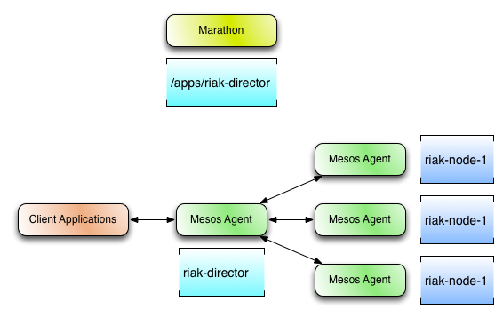

# Riak Mesos Framework [in beta]

An [Apache Mesos](http://mesos.apache.org/) framework for [Riak KV](http://basho.com/products/riak-kv/), a distributed NoSQL key-value data store that offers high availability, fault tolerance, operational simplicity, and scalability.

**Note:** This project is an early proof of concept. The code is a beta release and there may be bugs, incomplete features, incorrect documentation or other discrepancies.

## Installation

Please refer to the documentation in [riak-mesos-tools](https://github.com/basho-labs/riak-mesos-tools) for information about installation and usage of the Riak Mesos Framework.

## Build

For build and testing information, visit [docs/DEVELOPMENT.md](docs/DEVELOPMENT.md).

## Architecture

The Riak Mesos Framework is typically deployed as a marathon app via a CLI tool such as [riak-mesos or dcos riak](https://github.com/basho-labs/riak-mesos-tools). Once deployed, it can accept commands which result in the creation of Riak nodes as additional tasks on other Mesos agents.

### Scheduler

The Riak Mesos Framework scheduler is currently written in Golang due to [mesos-go's](https://github.com/mesos/mesos-go) usage of HTTP API calls accessible in the Mesos Master. The alternative language bindings mostly rely on `libmesos.so` which is more difficult to debug and work with in general.

#### Resourcing

The scheduler will attempt to spread Riak nodes across as many different mesos agents as possible to increase fault tolerance. If there are more nodes requested than there are agents available, the scheduler will then start adding more Riak nodes to existing agents. Following is a flowchart describing the basic logic followed by the scheduler to reserve resources, create persistent volumes, launch Riak nodes, and handle status updates for those nodes:

### Executor

The executor is written in Erlang, and manages a few processes including an [EPMD replacement](https://github.com/basho-labs/riak-mesos/tree/master/cepmd), and the Riak node process itself. We chose to have the executor run natively on the host machine using the Mesos containerizer in order to avoid usage of Docker due to concerns about its stability in certain Mesos environments. This creates a slightly more complicated build process since Erlang packages need to be built per platform, but it increases the reliability of the Mesos tasks.

#### Inter-node Communication

In normal environments, distributed erlang applications communicate with each other by attempting to connect on EPMD's default port, which then communicates the necessary connection information between the two applications. In a Mesos environment however, it is not always possible to assume that a port (such as EPMD's) will be available for binding, so we wrote a replacement called cEPMD to deal with this issue. cEPMD listens on a random port available on the Mesos agent, and coordinates which ports each node can talk on by storing that information in Zookeeper.

### Director

Due to the nature of Apache Mesos and the potential for Riak nodes to come and go on a regular basis, client applications using a Mesos based cluster must be kept up to date on the cluster's current state. Instead of requiring this intelligence to be built into Riak client libraries, a smart proxy application named `Director` has been created which can run alongside client applications.

For more information related to the Riak Mesos Director, please read [docs/DIRECTOR.md](docs/DIRECTOR.md)
