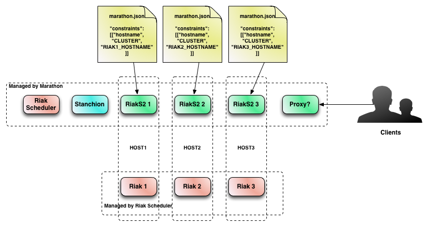

# Deploying Riak S2 with a Riak Cluster on Mesos

Included here is a sample configuration and scripts to deploy
[Riak S2](http://basho.com/products/riak-s2/) to an Apache Mesos cluster, using
Marathon.  The following general architecture is supported:



The provided deployment scripts and configuration deploys one Riak S2 instance
per Riak node, requesting the Riak S2 instance be allocated to the same host as
the Riak node.  The deployment automatically creates the Riak S2 admin user.

## Building Riak and Riak S2 packages

In order to deploy Riak S2 to Mesos, you need a custom build of Riak and Riak
S2.  If you want to do a local build, run the following from the top-level
directory of the repository:

```
TAGS='"rel native"' make rebuild_all_native
```

This will build the tarballs needed for Riak, the initial Riak S2 deployment,
Riak S2, and Stanchion.  They will be placed in the `_build` directory ready to
be served, as shown below.

But, the artifacts are all built and deployed to Amazon AWS so a local build is
not necessary.

## Configuration and Customization

You will want to make changes to the following before deploying:

In `deploy-complete.sh`, under the comment "Configuration items":
- NUM_NODES - the number of Riak nodes (and corresponding Riak S2 nodes) to
  create in your cluster
- DIRECTOR_IP - the IP address of the machine that will be running the Riak
  Mesos Framework director
- USEREMAIL - the email address of the Riak S2 admin user
- USERNAME - the name of the Riak S2 admin user

## Requirements and Assumptions

This setup deploys one Riak S2 node for every Riak node in the cluster.  These
are deployed to the same hosts, so ensure that you have enough available
resources to run both Riak and Riak S2.

This setup assumes you are running mesos-dns.  If you are not, you need to edit
the following files to replace all instances of leader.mesos with the hostname
or IP of your Mesos master node:
- deploy-complete.sh
- dcos-riak.json

The provided configurations and scripts assume that you are pulling the Riak
Mesos Framework and associated artifacts from the Riak Tools Amazon AWS site.
If you are doing a local build, edit the URIs in the following files:
- dcos-riak.json
- riak-s2-init.json.template
- riak-s2.json.template
- stanchion.json.template

Additionally, the URIs are for deploying to a CentOS host, however, Ubuntu and
CoreOS are also supported.  If you are deploying to one of those, edit the URIs
in the above files, replacing `centos` with `coreos` or `ubuntu`.

If you have built locally using the directions above, all of the artifacts will
be in the `_build` directory.  Serve them using this:

```
cd riak-mesos/_build
python -m SimpleHTTPServer
```

## Deploying Riak and Riak S2

After you've made the necessary configuration changes to `deploy-complete.sh`,
run:

```
./deploy-complete.sh
```

This will go through the entire process:
- Deploy a Riak cluster with NUM_NODES (3 is the default)
- Display the various endpoints and connection information for the Riak cluster
- Deploy an initial Riak S2 configuration and create the Riak S2 admin user
- Display the information on the newly created Riak S2 admin user
- Deploy one Stanchion instance, needed by Riak S2
- Deploy NUM_NODES Riak S2 instances, on the same hosts as the Riak nodes
- Display the connection information for the newly created Riak S2 nodes

## Accessing your newly deployed Riak S2 cluster

At the end of the run of `deploy-complete.sh`, the hostnames and ports of the
Riak S2 instances will be displayed.  You may configure your S3 client to use
any of these.  Also, if you are using mesos-dns, these will also be accessible
from the following hostnames:
- riak-s2-1.marathon.mesos
- riak-s2-2.marathon.mesos
- riak-s2-3.marathon.mesos

or corresponding entries to the number of Riak nodes are in your cluster.

Included is a sample [s3cmd](http://s3tools.org/s3cmd) configuration file,
`s3cfg`.  Edit the file and replace `ACCESS_KEY`, `SECRET_KEY`, `RIAKS2_HOST`,
and `RIAKS2_PORT` with the appropriate values from your system.  You can then
use it like this:

```
s3cmd -c s3cfg mb s3://mybucket
s3cmd -c s3cfg ls s3://mybucket
```

## Further information

Please see the [Riak S2 Documentation](http://docs.basho.com/riakcs/latest/) for
further information on using and configuring Riak S2.
